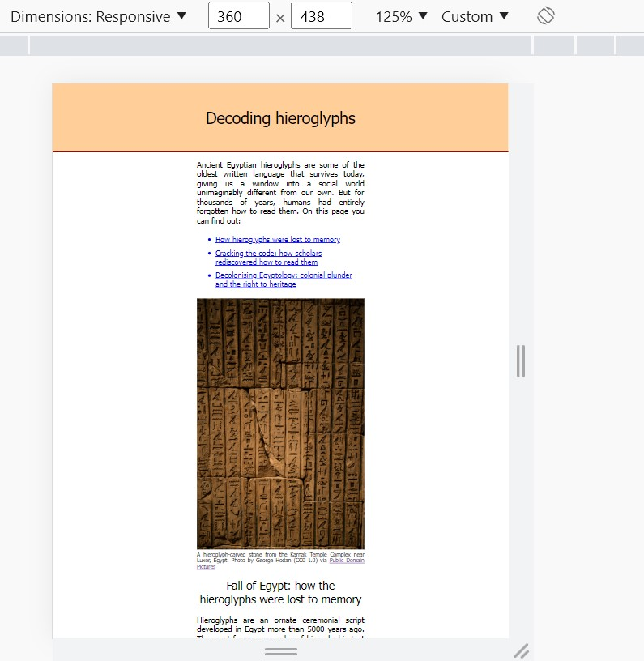
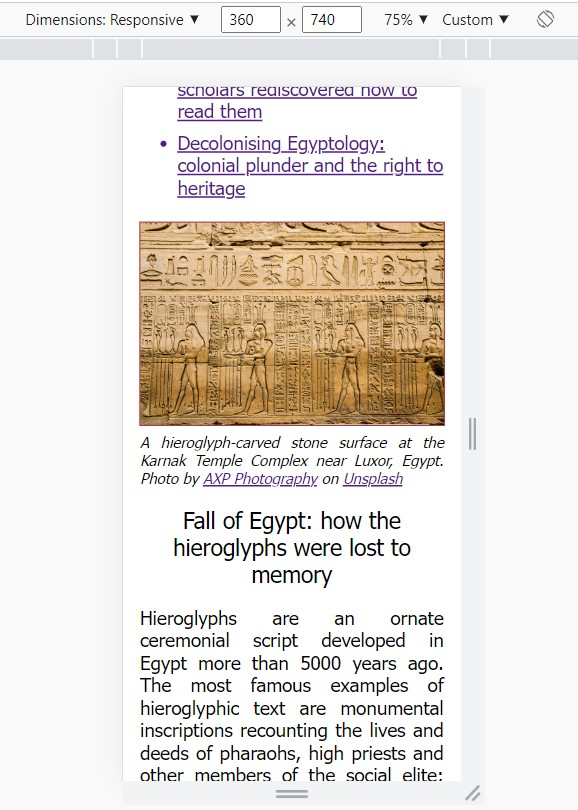

# Hobby Page - Decoding Hieroglyphs

## Summary

For the first project in my Founders and Coders bootcamp application, I created a webpage titled “Decoding Hieroglyphs”. The page looks at how the art of hieroglyphic writing died out in Egypt with the coming of early Christianity, and was later rediscovered when European scholars used the Rosetta Stone discovery to decode the language. Readers also learn about efforts by Egyptian scholars to have the Stone repatriated to Egypt, and are invited to support this effort by signing an online petition.

The page is a fairly simple combination of a .css stylesheet file with a .html index file. It does not allow for very much user interactivity. The .html file does incorporate a script snippet that uses DOM manipulation to display today’s date (see point (3) below).

## Phases of work on this project

I approached this project with almost no knowledge of html or css, and no knowledge at all of how to create, update and publish remote repositories. I progressed through several stages, explained below.

It wasn’t until around the mid-point of this project that I set time aside to study Git and GitHub in the necessary detail to make use of them. Up to that point I had some very frustrating experiences trying to stage and commit files without properly understanding the process. I only started the current repository after gaining a working knowledge of Git, so the first commit here reflects my html and css writing process at about its midpoint in time.

### (1) Basic structure and css decisions

The first thing I did was to create an html document with a basic structure corresponding to the content I wanted to present, namely a header (containing an h1 element), a footer (containing a 
 element with an ID), an introductory paragraph, and three text sections, each with their own sub-header. I added an unordered list after the introduction, with each item acting as an anchor link to one of the three sections. I opted for Tahoma and for fairly large font sizes in this task in order to maximise accessibility.

### (2) Initial attempt at responsive design

Taking the advice of a Founders and Coders mentor at a coding meet-up, I used a mobile-first design where most content was kept into a single column. gave the <main> element an absolute width of 360px to start with. Again following the mentor's advice, I populated the three sections with lorem ipsum text.

### (3) Placing the date

One of the more challenging parts of this project for me was to place the current date on the webpage via DOM manipulation. It wasn’t initially clear to me what the DOM is and why JS needs to make reference to it, and I needed to engage in significant self-study (reading resources and watching YouTube tutorials) in order to get a hold on this; I didn’t want to simply copy and paste the method until I understand how and why it works. 

To give the date a more natural integration with the webpage content, I paired it with a link to a website where users can convert today’s date into a date in the Ancient Egyptian calendar.

### (4) Replacing lorem ipsum text with real content 

At this point, I carried out more research on the subject matter of my page and replaced the lorem ipsum text with real content. I wanted to know the final amount of content the page would contain before I carried out the task of making the page responsive.

I set out to write the project after visiting the British Museum’s exhibition titled “Hieroglyphs: Unlocking Ancient Egypt”. However, when researching around the topic I discovered that a prominent campaign was launched recently by Egyptian archaeologists calling for the Rosetta Stone (the artefact that made decipherment of hieroglyphs possible) to be repatriated to Egypt. I felt this context deserved to be prominently featured in the page, so recalibrated the focus of my content such that the third and final section would platform that campaign and invite webpage visitors to support it.

### (5) Making the page responsive

At this point in time my page’s content was still laid out in a single column with its width fixed to 360px (except for the header and footer background styling, which was set to 100vw). Though this was an attempt at mobile-first design, it didn’t use responsive design techniques. Despite the various body sub-elements having a width set to 360px, the main column of content did not fill the screen width when viewed on a mobile device, but was shrunk into the screen centre (see below):

Before using @media queries to make the page responsive, I made an effort to understand why this shrinking effect was happening. I asked ChatGPT this question and received a list of possible answers but didn’t allocate time to working through each of them exhaustively.

I set up @media queries on the necessary elements (main, h1 and #footertext) to make the page responsive. I also chose to change the portrait image I had initially used (which had a large height) for a landscape image that would not impose so much scrolling on mobile device users. The responsive page, viewed with mobile device dimensions, can be seen below:

## What I learned

This was my first-ever development project and I learned an absolutely massive amount doing it. As well as the html and css code itself I studied Git and GitHub in depth, and (relatedly) learned about the principles of version control as used by developers. I spent more hours learning to use VS Code, Git and GitHub, and troubleshooting with each of them, than I spent either writing code or learning to do so. I began using Discord (which I’d never previously used) and asked questions there as well as at Founders and Coders meet-ups. 

## Acknowledgements

The two most visible influences on the webpage’s content are the British Museum’s “Unlocking Ancient Egypt” exhibition, and the “Repatriate Rashid” campaign. As recounted above, every technical aspect of my process of creating the page was underpinned by peer support – both that of Founders and Coders mentors and participants, and that of other beginner devs who’ve populated online forums with useful threads over the years.